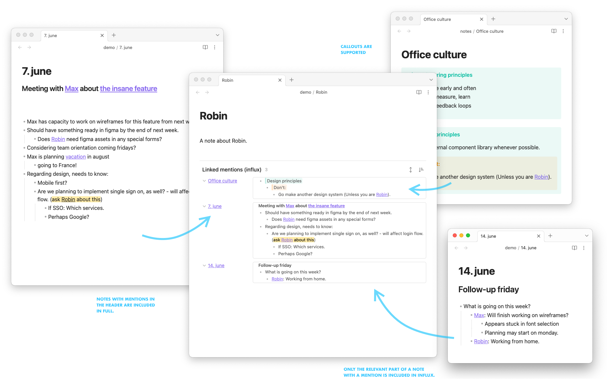

# Influx Documentation

**Influx** transforms your Obsidian backlinks from simple links into rich, contextual excerpts that help you discover connections in your notes. Instead of seeing just a list of note titles, you'll see the actual content surrounding each link, giving you immediate context and understanding.



## Why Influx?

Obsidian's core backlinks show you *that* notes are connected, but Influx shows you *how* and *why* they're connected. This transforms your backlinks from a simple navigation tool into a powerful research and discovery engine.

Perfect for:

- **Academic research**: Trace ideas and sources across your knowledge base
- **Knowledge management**: Build interconnected webs of understanding
- **Creative writing**: Track themes, characters, and plot development
- **Personal learning**: Discover unexpected connections in your notes

This guide covers everything from basic setup to advanced customization.

## Quick Start

Once installed and enabled, Influx automatically appears at the bottom of your notes showing contextual backlinks. 

**Basic setup**: Go to **Settings** → **Community Plugins** → **Influx** to customize your experience.

## Configuration

### Display Options

- **Excerpt Length**: Control how much context to show around each backlink
  - *Recommended*: 150 characters for most use cases
  - *Research*: 200-250 characters for academic work
  - *Quick scan*: 100 characters for rapid review

- **Grouping**: Organize backlinks by hierarchy or chronology
  - *By hierarchy*: Groups content by bullet point structure (great for organized notes)
  - *Chronological*: Shows most recent links first (good for active projects)

- **Sorting**: Choose how to order your backlinks (alphabetical, by date, etc.)
  - *Alphabetical*: Easiest to find specific notes
  - *By modification date*: See recently updated content first

### Layout Settings

- **Max Items**: Limit the number of backlinks shown
  - *Recommended*: 10-15 items to keep view manageable
  - *Large vaults*: Consider 5-8 items for better performance

- **Show Hierarchy**: Display bullet point structure
  - *Enable*: When you want to see the organizational context
  - *Disable*: For cleaner, more compact display

- **Compact Mode**: Reduce spacing for dense information
  - *Great for*: Mobile devices or when screen space is limited

### Filtering

- **Exclude Files**: Hide backlinks from specific files or folders
  - *Common exclusions*: Templates, daily notes, archived content
  - *Example pattern*: `templates/` or `daily-notes/`

- **Include Only**: Show backlinks only from selected sources
  - *Use case*: Focus on specific project folders or research areas

- **Minimum Context**: Filter out links with insufficient context
  - *Recommended*: 20 characters minimum to avoid meaningless fragments

## Usage Examples

### Academic Research

**Scenario**: Writing a literature review for your thesis

**Configuration**:

- Excerpt Length: 200 characters (for detailed context)
- Grouping: By hierarchy (to see argument structure)
- Max Items: 15 (comprehensive view)

**Benefits**:

- Trace how different papers cite the same sources
- See the context around citations to understand relevance
- Discover connections between related concepts across your research notes

### Knowledge Management

**Scenario**: Building a personal knowledge base on machine learning

**Configuration**:

- Excerpt Length: 150 characters (balanced view)
- Grouping: Chronological (track learning progression)
- Sorting: Alphabetical (easy navigation)

**Benefits**:

- See how your understanding of concepts evolved over time
- Connect beginner concepts to advanced applications
- Build a web of understanding that shows relationships, not just links

### Creative Writing

**Scenario**: Tracking character development in a novel

**Configuration**:

- Excerpt Length: 100 characters (quick context)
- Grouping: By hierarchy (organize by story arcs)
- Max Items: 8 (focused view)

**Benefits**:

- Track character traits across different chapters
- See how plot points connect and build on each other
- Maintain consistency in themes and motifs throughout your story

## Advanced Features

### Custom CSS

Add custom styles to match your Obsidian theme:

```css
/* Make excerpts more subtle */
.influx-excerpt {
  font-style: italic;
  color: var(--text-muted);
}

/* Highlight the source file */
.influx-source {
  font-weight: 600;
  color: var(--text-accent);
}

/* Compact spacing for mobile */
@media (max-width: 768px) {
  .influx-item {
    margin-bottom: 0.5rem;
  }
}
```

### Front Matter Integration

Influx automatically processes links from YAML front matter, allowing you to:

- Track metadata connections (tags, categories, projects)
- See relationships defined in your note properties
- Discover connections through structured data

**Example front matter**:

```yaml
---
tags: [research, psychology]
related: [[cognitive-bias]], [[decision-making]]
project: thesis-chapter-2
---
```

### Performance Tips

For large vaults or optimal performance:

1. **Reduce Max Items**: Limit to 5-10 items for faster rendering
2. **Use Filtering**: Exclude template folders or daily notes
3. **Enable Compact Mode**: Reduces DOM overhead
4. **Set Minimum Context**: Filter out short, meaningless fragments

## Troubleshooting

### Backlinks not showing

1. Ensure Influx is enabled in Community Plugins
2. Check that the current file has incoming links
3. Verify file indexing is complete in Obsidian

### Performance issues

- Reduce the maximum number of displayed items
- Exclude large folders from indexing
- Use compact mode for faster rendering

## Contributing

Found a bug or have a feature request? Please [open an issue](https://github.com/jensmtg/influx/issues) on GitHub.

## Project Maintainers

**Current Maintainer**: [@semanticdata](https://github.com/semanticdata) (Miguel Pimentel)

**Original Creator**: [@jensmtg](https://github.com/jensmtg) (Jens M Gleditsch)

## Changelog

See the [Changelog](CHANGELOG.md) for version history and updates.
