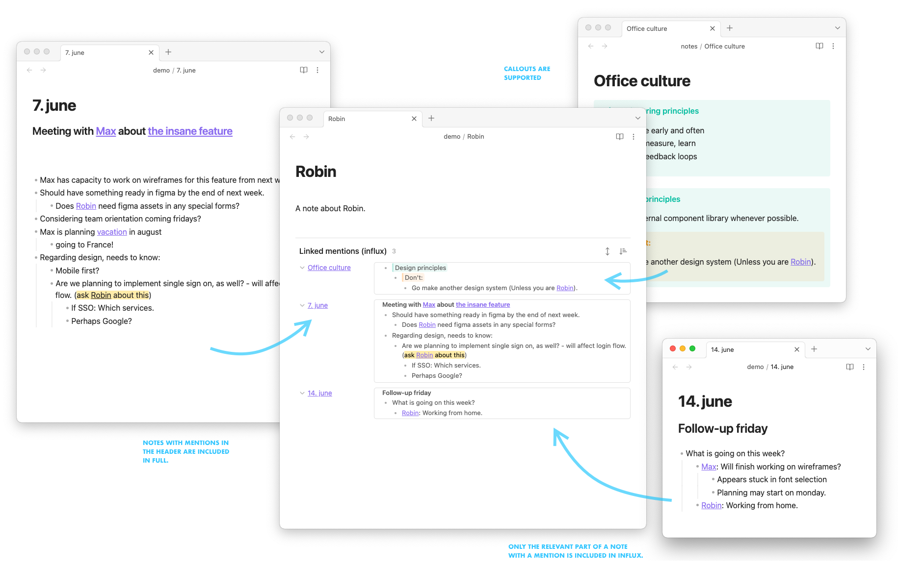

# Influx Documentation

**Influx** adds context to Obsidian backlinks by showing excerpts around each link. This helps you review connections without opening every source note.



## Why Influx?

Obsidian's core backlinks show *that* notes are connected. Influx shows *how* they are connected by including nearby text.

Perfect for:

- **Academic research**: Trace ideas and sources across your knowledge base
- **Knowledge management**: Build interconnected webs of understanding
- **Creative writing**: Track themes, characters, and plot development
- **Personal learning**: Discover unexpected connections in your notes

This guide covers everything from basic setup to advanced customization.

## Quick Start

Once installed and enabled, Influx automatically appears at the bottom of your notes showing contextual backlinks. 

**Basic setup**: Go to **Settings** → **Community Plugins** → **Influx** to customize your experience.

## Configuration

### Display Options

- **Sorting attribute**: Order backlinks by `mtime`, `ctime`, or `FILENAME`
  - *Recommended*: `mtime` for active work
  - *Reference vaults*: `FILENAME` for predictable lookup

- **Sorting principle**: Choose `NEWEST_FIRST` or `OLDEST_FIRST`
  - *Recommended*: `NEWEST_FIRST`

- **List length**: Limit how many linked notes are rendered
  - *Recommended*: `10-15`
  - *Large vaults*: `5-10` for faster first paint

### Layout Settings

- **Layout variant**: `Continous stream` or `Note by note`
  - *Continous stream*: Better for skimming
  - *Note by note*: Better source separation

- **Show Influx below text**: Place Influx below the note body or at the top

- **Show headers**: Include first heading/frontmatter title from source notes

### Filtering

- **Exclude Files**: Hide backlinks from specific files or folders
  - *Common exclusions*: Templates, daily notes, archived content
  - *Example pattern*: `templates/` or `daily-notes/`

- **Include Only**: Show backlinks only from selected sources
  - *Use case*: Focus on specific project folders or research areas

- **Require frontmatter key**: Only show Influx on notes with `influx: true`
- **Collapse all by default**: Start every note with backlink entries collapsed

## Usage Examples

### Academic Research

**Scenario**: Writing a literature review for your thesis

**Configuration**:

- Sorting attribute: `mtime`
- Sorting principle: `NEWEST_FIRST`
- List length: `15`
- Layout variant: `Note by note`

**Benefits**:

- Trace how different papers cite the same sources
- See the context around citations to understand relevance
- Discover connections between related concepts across your research notes

### Knowledge Management

**Scenario**: Building a personal knowledge base on machine learning

**Configuration**:

- Sorting attribute: `FILENAME`
- Sorting principle: `NEWEST_FIRST`
- List length: `10`
- Display location: `Sidebar`

**Benefits**:

- See how your understanding of concepts evolved over time
- Connect beginner concepts to advanced applications
- Build a web of understanding that shows relationships, not just links

### Creative Writing

**Scenario**: Tracking character development in a novel

**Configuration**:

- Sorting attribute: `mtime`
- Sorting principle: `NEWEST_FIRST`
- List length: `8`
- Collapse all by default: `Enabled`

**Benefits**:

- Track character traits across different chapters
- See how plot points connect and build on each other
- Maintain consistency in themes and motifs throughout your story

## Advanced Features

### Custom CSS

Add custom styles to match your Obsidian theme:

```css
/* Make excerpts more subtle */
.influx-excerpt {
  font-style: italic;
  color: var(--text-muted);
}

/* Highlight the source file */
.influx-source {
  font-weight: 600;
  color: var(--text-accent);
}

/* Compact spacing for mobile */
@media (max-width: 768px) {
  .influx-item {
    margin-bottom: 0.5rem;
  }
}
```

### Front Matter Integration

Influx automatically processes links from YAML front matter, allowing you to:

- Track metadata connections (tags, categories, projects)
- See relationships defined in your note properties
- Discover connections through structured data

**Example front matter**:

```yaml
---
tags: [research, psychology]
related: [[cognitive-bias]], [[decision-making]]
project: thesis-chapter-2
---
```

### Performance Tips

For large vaults or optimal performance:

1. **Reduce List length**: Limit to 5-10 items for faster rendering
2. **Use source filtering**: Exclude templates, archive, and high-churn folders
3. **Disable live update**: Reduce update churn while writing
4. **Use Sidebar mode**: Keep one render target when reviewing many notes

## Troubleshooting

### Backlinks not showing

1. Ensure Influx is enabled in Community Plugins
2. Check that the current file has incoming links
3. Verify file indexing is complete in Obsidian

### Performance issues

- Reduce the maximum number of displayed items
- Exclude large folders from indexing
- Disable live update while editing large notes

## Contributing

Found a bug or have a feature request? Please [open an issue](https://github.com/jensmtg/influx/issues) on GitHub.

See [CONTRIBUTING](CONTRIBUTING.md) for more information.

## Project Maintainers

**Current Maintainer**: [@semanticdata](https://github.com/semanticdata) (Miguel Pimentel)

**Original Creator**: [@jensmtg](https://github.com/jensmtg) (Jens M Gleditsch)

## Changelog

See the [Changelog](CHANGELOG.md) for version history and updates.
